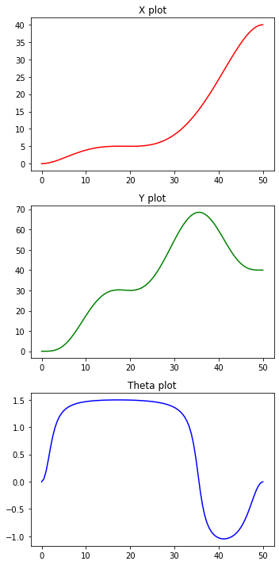
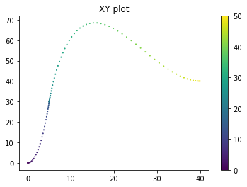
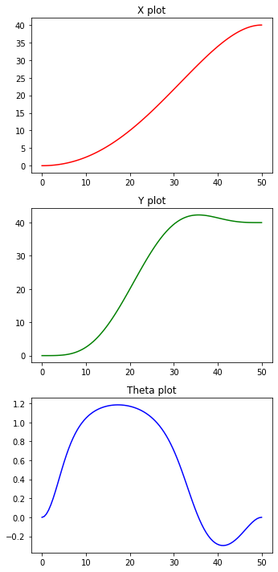
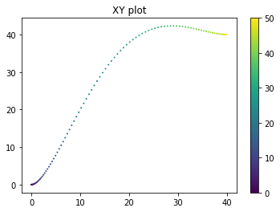
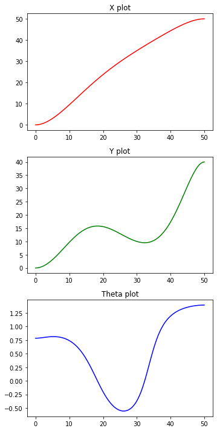
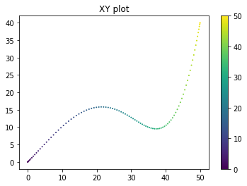
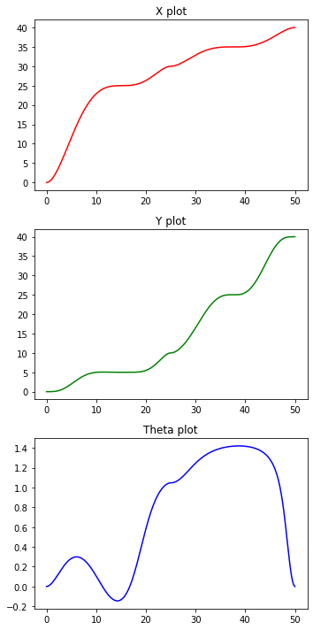
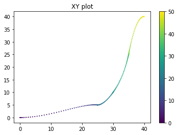

# Video recordings

The video recordings for different experiments, along with observations.

All videos can be found [here](https://iiitaphyd-my.sharepoint.com/:f:/g/personal/avneesh_mishra_research_iiit_ac_in/EogE243Ab4lDvm5VSueCLY8B7tLHOWnVw8i8PQnv5Bndfg?e=k8xJ1n).

## Table of contents

- [Video recordings](#video-recordings)
    - [Table of contents](#table-of-contents)
    - [Single Waypoint Experiments](#single-waypoint-experiments)
        - [Recording 1](#recording-1)
        - [Recording 2](#recording-2)
        - [Recording 3](#recording-3)
    - [Obstacle Avoidance](#obstacle-avoidance)
        - [Recording 4](#recording-4)

## Single Waypoint Experiments

Experiments involving path through a single waypoint.

### Recording 1

**File Name**: `out_1.avi` <br>
**Parameters**:

```py
    # ==== Begin: User configuration area ====
    # Points as [x, y]
    start_pt = [0, 0]
    end_pt = [40, 40]
    way_pt = [5, 30]
    # Time values
    to, tw, tf = [0, 20, 50]    # Start, waypoint, end
    # Other parameters
    ko, kw, kf = [0, np.tan(np.pi/5), 0]    # k = np.tan(theta)
    dko, dkw, dkf = [0, 0, 0]
    dxo, dxw, dxf = [0, 0, 0]
    # ==== End: User configuration area ====
```

The following results were achieved through the above configurations




**Observations**: The constraints for the `dx` at the waypoint is being adhered (the vehicle comes to a stop there). It'll be more beneficial not to stop at waypoints.

### Recording 2

**File Name**: `out_2.avi` <br>
**Parameters**:

```py
    # ==== Begin: User configuration area ====
    # Points as [x, y]
    start_pt = [0, 0]
    end_pt = [40, 40]
    way_pt = [10, 20]
    # Time values
    to, tw, tf = [0, 20, 50]    # Start, waypoint, end
    # Other parameters
    ko, kw, kf = [0, np.tan(np.pi/5), 0]    # k = np.tan(theta)
    dko, dkw, dkf = [0, 0, 0]
    dxo, dxw, dxf = [0, 1, 0]
    # ==== End: User configuration area ====
```

The following results were achieved through the above configurations




**Observations**: Here, the vehicle doesn't stop at the waypoints, which makes the overall curve much better.

### Recording 3

**File Name**: `out_3.avi` <br>
**Parameters**:

```py
    # ==== Begin: User configuration area ====
    # Points as [x, y]
    start_pt = [0, 0]
    end_pt = [50, 40]
    way_pt = [35, 10]
    # Time values
    to, tw, tf = [0, 30, 50]    # Start, waypoint, end
    # Other parameters
    ko, kw, kf = [np.tan(np.deg2rad(45)), 
        np.tan(np.pi/5), 
        np.tan(np.deg2rad(80))]    # k = np.tan(theta)
    dko, dkw, dkf = [0, 0, 0]
    dxo, dxw, dxf = [0, 1, 0]
    # ==== End: User configuration area ====
```

The following results were achieved through the above configurations




**Observations**: Here, the vehicle starts and ends with an angle other than zero. This makes the curve better conditioned, and there is very little overshoot. It also has a very nice curve to reach the waypoint and return to the goal.

## Obstacle Avoidance

Two bernstein polynomials were concatenated and the intermediate point is to avoid the obstacle.

### Recording 4

**File Name**: `out_4` <br>
**Parameters**:

```py
# ==== Begin: User configuration area (original) ====
# Points as [x, y]
start_pt = [0, 0]
end_pt = [40, 40]
way_pt = [10, 20]
# Time values
to, tw, tf = [0, 20, 50]    # Start, waypoint, end
# Other parameters
ko, kw, kf = [0, np.tan(np.pi/5), 0]    # k = np.tan(theta)
dko, dkw, dkf = [0, 0, 0]
dxo, dxw, dxf = [0, 0, 0]
# ==== End: User configuration area ====
circle_obs = [10, 20, 5]
# ==== Begin: User configuration area (part 1) ====
# Points as [x, y]
start_pt = [0, 0]
end_pt = [30, 10]   # New end point
way_pt = [25, 5]   # Move waypoint out of circle
# Time values
to, tw, tf = [0, 15, 25]    # Start, waypoint, end
# Other parameters
ko, kw, kf = [0, 0, np.tan(np.deg2rad(60))]    # k = np.tan(theta)
dko, dkw, dkf = [0, 0, 0]
dxo, dxw, dxf = [0, 0, 0]
# ==== End: User configuration area ====
# ==== Begin: User configuration area (part 2) ====
# Points as [x, y]
start_pt = [30, 10]
end_pt = [40, 40]
way_pt = [35, 25]   # Move waypoint out of circle
# Time values
to, tw, tf = [25, 38, 50]    # Start, waypoint, end
# Other parameters
ko, kw, kf = [np.tan(np.deg2rad(60)), 0, 0]    # k = np.tan(theta)
dko, dkw, dkf = [0, 0, 0]
dxo, dxw, dxf = [0, 0, 0]
# ==== End: User configuration area ====
```




**Observations**: As we can see, the obstacle was avoided.
