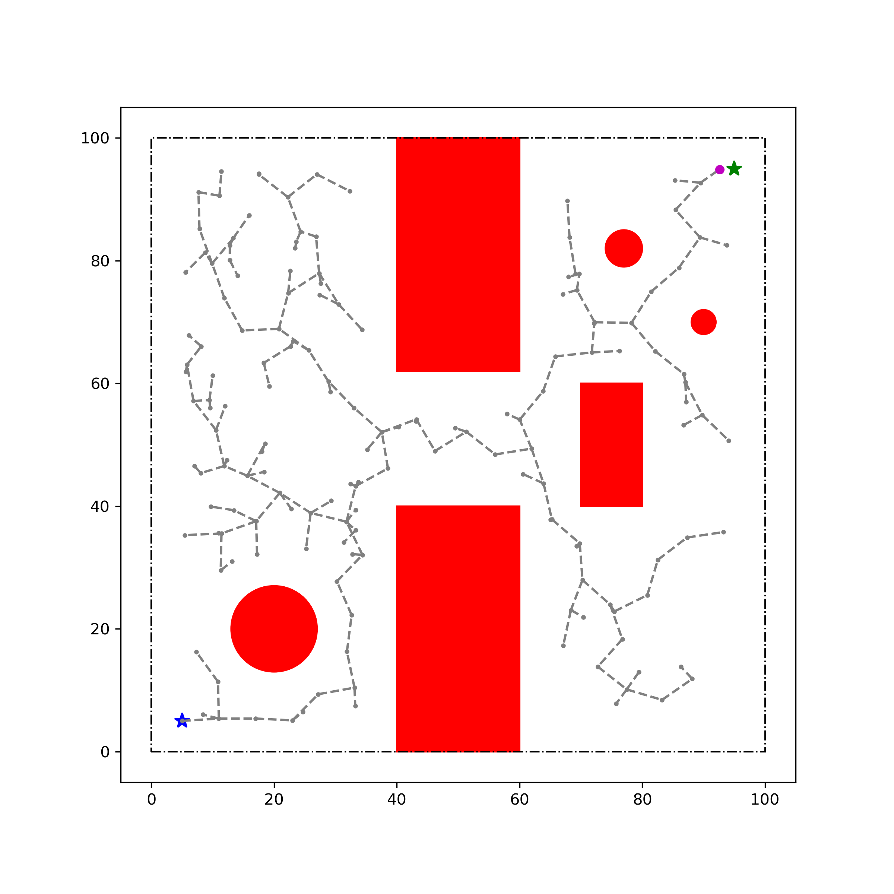
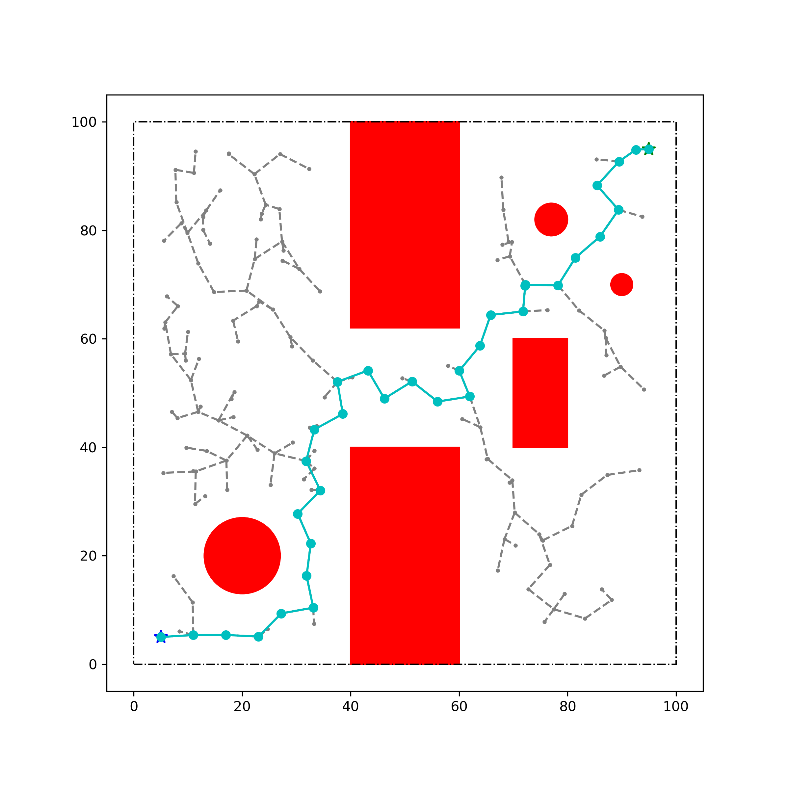

# Assignment 1 - RPN

Assignment 1 of EC4.403 - Spring 2022 - Robotics: Planning and Navigation

**Team Name**: Over 9000  
**Team Members**: Laksh Nanwani (2021701002), Avneesh Mishra (2021701032)

## Table of contents

- [Assignment 1 - RPN](#assignment-1---rpn)
    - [Table of contents](#table-of-contents)
    - [Contents](#contents)
    - [Non-Holonomic RRT](#non-holonomic-rrt)
    - [References](#references)

## Contents

The contents of this folder are described as follows

| S. No. | Item | Description |
| :----- | :--- | :---------- |
| 1 | [README_instructions.md](./README_instructions.md) | The original README provided with instructions |
| 2 | [Assignment1.pdf](./Assignment1.pdf) | Assignment questions given |
| 3 | [mkmovie.sh](./mkmovie.sh) | Script to make a movie from PNG images in a directory using [ffmpeg](https://ffmpeg.org/documentation.html) |
| 4 | [Q1_Over 9000_2021701032.ipynb](./Q1_Over%209000_2021701032.ipynb) | Answer to question 1 in the PDF: Non-Holonomic RRT implementation. Check out [non-holonomic-rrt](#non-holonomic-rrt). |
| 5 | [Q2__Over_9000__roll_no.ipynb](./Q2__Over_9000__roll_no.ipynb) | Answer to question 2 in the PDF: Holonomic RRT |

## Non-Holonomic RRT

The non-holonomic case has the following results (from the first run)

The videos can be found [here](https://bit.ly/350ilbF) (ask @TheProjectsGuy if there are access issues). Because of the nature of the assignment, if runs were not saved, the paths may be slightly different.

The following files were used for this

| S. No. | File | Description |
| :---- | :----- | :---- |
| 1 | [Q1_Over 9000_2021701032.ipynb](./Q1_Over%209000_2021701032.ipynb) | The notebook for submission |
| 2 | [lib/rrt_planar_solver.py](./lib/rrt_planar_solver.py) | A library to handle the planar RRT calculations and solving. Keeps the notebook less cluttered. The script can also be run as main. The `SolverRRT` class can be pickled for saving! |
| 3 | [tools/imgs_to_vid.py](./tools/imgs_to_vid.py) | Converts a sequence of images in a folder to a video file, provided the FPS. |
| 4 | [rrt_nonh_dd_solver.py](./lib/rrt_nonh_dd_solver.py) and [viz_outcache.py](./lib/viz_outcache.py) | Solve and visualize the non-holonomic RRT. See output in [non_holonomic_out](./non_holonomic_out/). The scripts above are for generating a holonomic path and then having a non-holonomic robot follow it. This script generates a path using the non-holonomic constraints. |

## References

References for the work in this repository

1. PythonRobotics: a Python code collection of robotics algorithms: [arXiv](https://arxiv.org/abs/1808.10703), [readthedocs](https://pythonrobotics.readthedocs.io/en/latest/index.html)
